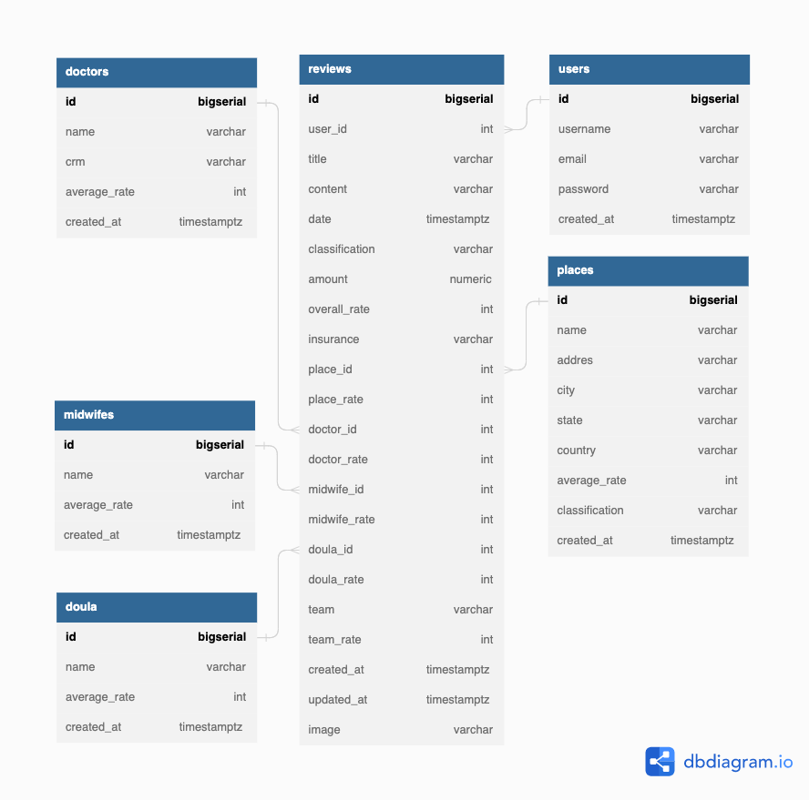

# Instituto Maternar

An open project of a RESTful API to enable women to share their childbirth stories in order to empower others, leading to better decisions towards health facilities and professionals. This project also aims to assist policymakers and institutions on the prevention and combate of obstetric violence.   



db schema built with [dbdiagram](https://dbdiagram.io/home) 


how to run this project: 

```
add the following parameters to a .env file in the project root

DB_DRIVER
DB_SOURCE
SERVER_ADDRESS
PGADMIN_DEFAULT_EMAIL
PGADMIN_DEFAULT_PASSWORD
```
